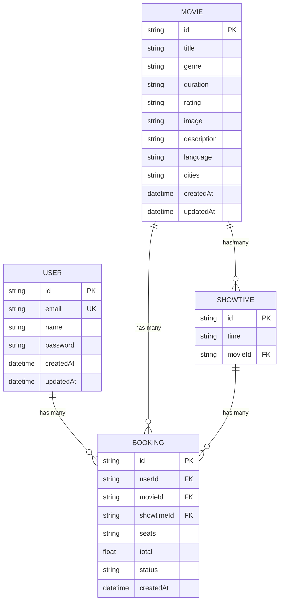

# 🗄️ Movie Booking System - Database ER Diagram

## Database Schema Overview

This database uses **SQLite** with **Prisma ORM** and consists of **4 main entities** with defined relationships.

---

## 📊 Visual ER Diagram

```
┌─────────────────────────────────────────────────────────────────────────────┐
│                     MOVIE BOOKING SYSTEM - DATABASE SCHEMA                   │
└─────────────────────────────────────────────────────────────────────────────┘

┌──────────────────────┐
│       USER           │
├──────────────────────┤
│ 🔑 id (PK)           │───┐
│    email (UNIQUE)    │   │
│    name              │   │
│    password          │   │ 1
│    createdAt         │   │
│    updatedAt         │   │
└──────────────────────┘   │
                           │
                           │ has many
                           │
                           │ N
                           ▼
                    ┌──────────────────────┐
                    │      BOOKING         │
                    ├──────────────────────┤
                    │ 🔑 id (PK)           │
                    │ 🔗 userId (FK)       │──────┐
                    │ 🔗 movieId (FK)      │──┐   │
                    │ 🔗 showtimeId (FK)   │  │   │
                    │    seats (JSON)      │  │   │
                    │    total             │  │   │
                    │    status            │  │   │
                    │    createdAt         │  │   │
                    └──────────────────────┘  │   │
                           ▲                  │   │
                           │                  │   │
                         N │                  │   │
                           │                  │   │
                           │ has many         │   │
                           │                  │   │
┌──────────────────────┐  │ 1                │   │
│      MOVIE           │──┘                  │   │
├──────────────────────┤                     │   │
│ 🔑 id (PK)           │─────────────────────┘   │
│    title             │                         │
│    genre             │                         │
│    duration          │                         │
│    rating            │                         │
│    image             │                         │
│    description       │                         │
│    language          │                         │
│    cities            │                         │
│    createdAt         │                         │
│    updatedAt         │                         │
└──────────────────────┘                         │
         │                                        │
         │ 1                                      │
         │                                        │
         │ has many                               │
         │                                        │
         │ N                                      │
         ▼                                        │
┌──────────────────────┐                         │
│     SHOWTIME         │                         │
├──────────────────────┤                         │
│ 🔑 id (PK)           │─────────────────────────┘
│    time              │
│ 🔗 movieId (FK)      │
└──────────────────────┘
```

**Legend:**
- 🔑 = Primary Key
- 🔗 = Foreign Key
- 1 = One
- N = Many
- (UNIQUE) = Unique constraint

---

## 📋 Entity Details

### 1️⃣ **USER** Entity

**Purpose:** Stores user account information for authentication and booking management.

| Column Name | Data Type | Constraints | Description |
|-------------|-----------|-------------|-------------|
| **id** | String | PRIMARY KEY, CUID | Unique user identifier |
| email | String | UNIQUE, NOT NULL | User's email address |
| name | String | NULLABLE | User's display name |
| password | String | NOT NULL | Hashed password |
| createdAt | DateTime | DEFAULT now() | Account creation timestamp |
| updatedAt | DateTime | AUTO UPDATE | Last update timestamp |

**Relationships:**
- ✅ One User → Many Bookings (1:N)

---

### 2️⃣ **MOVIE** Entity

**Purpose:** Stores movie information including metadata and screening details.

| Column Name | Data Type | Constraints | Description |
|-------------|-----------|-------------|-------------|
| **id** | String | PRIMARY KEY, CUID | Unique movie identifier |
| title | String | NOT NULL | Movie title |
| genre | String | NOT NULL | Movie genre (Action, Drama, etc.) |
| duration | String | NOT NULL | Runtime (e.g., "2h 30m") |
| rating | String | NOT NULL | Content rating (PG-13, R, etc.) |
| image | String | NOT NULL | Poster image URL |
| description | String | NOT NULL | Movie synopsis |
| language | String | NULLABLE | Primary language |
| cities | String | NOT NULL | Comma-separated city list |
| createdAt | DateTime | DEFAULT now() | Record creation timestamp |
| updatedAt | DateTime | AUTO UPDATE | Last update timestamp |

**Relationships:**
- ✅ One Movie → Many Showtimes (1:N)
- ✅ One Movie → Many Bookings (1:N)

---

### 3️⃣ **SHOWTIME** Entity

**Purpose:** Represents specific screening times for movies.

| Column Name | Data Type | Constraints | Description |
|-------------|-----------|-------------|-------------|
| **id** | String | PRIMARY KEY, CUID | Unique showtime identifier |
| time | String | NOT NULL | Screening time (e.g., "7:00 PM") |
| **movieId** | String | FOREIGN KEY → Movie.id | Reference to movie |

**Relationships:**
- ✅ Many Showtimes → One Movie (N:1)
- ✅ One Showtime → Many Bookings (1:N)

---

### 4️⃣ **BOOKING** Entity

**Purpose:** Records user ticket bookings with seat selection and payment details.

| Column Name | Data Type | Constraints | Description |
|-------------|-----------|-------------|-------------|
| **id** | String | PRIMARY KEY, CUID | Unique booking identifier |
| **userId** | String | FOREIGN KEY → User.id | Reference to user |
| **movieId** | String | FOREIGN KEY → Movie.id | Reference to movie |
| **showtimeId** | String | FOREIGN KEY → Showtime.id | Reference to showtime |
| seats | String | NOT NULL | JSON string of selected seats |
| total | Float | NOT NULL | Total payment amount |
| status | String | DEFAULT "confirmed" | Booking status |
| createdAt | DateTime | DEFAULT now() | Booking timestamp |

**Relationships:**
- ✅ Many Bookings → One User (N:1)
- ✅ Many Bookings → One Movie (N:1)
- ✅ Many Bookings → One Showtime (N:1)

---

## 🔗 Relationship Summary

| Relationship | Type | Description |
|--------------|------|-------------|
| User ↔ Booking | **1:N** | One user can have multiple bookings |
| Movie ↔ Showtime | **1:N** | One movie can have multiple showtimes |
| Movie ↔ Booking | **1:N** | One movie can have multiple bookings |
| Showtime ↔ Booking | **1:N** | One showtime can have multiple bookings |

---

## 🎯 Key Design Decisions

### ✅ **CUID for Primary Keys**
- Uses `cuid()` instead of auto-increment integers
- Provides globally unique, collision-resistant IDs
- Better for distributed systems and security

### ✅ **String-based Foreign Keys**
- Consistent with CUID primary keys
- Enables cross-database portability

### ✅ **JSON Storage for Seats**
- Seats stored as JSON string for flexibility
- Example: `["A1", "A2", "A3"]`
- Avoids need for separate seat entity

### ✅ **Comma-Separated Cities**
- Simple approach for multiple city support
- Easy to query with SQL LIKE
- Can be normalized later if needed

### ✅ **Timestamps for Audit Trail**
- `createdAt` and `updatedAt` on main entities
- Enables tracking of when records were created/modified

---

## 📈 Cardinality Explained

```
USER (1) ──< BOOKING (N)
  One user can make many bookings

MOVIE (1) ──< SHOWTIME (N)
  One movie can have many showtimes

MOVIE (1) ──< BOOKING (N)
  One movie can have many bookings

SHOWTIME (1) ──< BOOKING (N)
  One showtime can have many bookings
```

---

## 🔍 Sample Query Patterns

### Get all bookings for a user:
```sql
SELECT * FROM Booking WHERE userId = ?
```

### Get all showtimes for a movie:
```sql
SELECT * FROM Showtime WHERE movieId = ?
```

### Get complete booking details (with joins):
```sql
SELECT 
  Booking.*,
  User.email,
  Movie.title,
  Showtime.time
FROM Booking
JOIN User ON Booking.userId = User.id
JOIN Movie ON Booking.movieId = Movie.id
JOIN Showtime ON Booking.showtimeId = Showtime.id
WHERE Booking.id = ?
```

---

## 📦 Database File

- **Location:** `prisma/dev.db`
- **Type:** SQLite database file
- **Size:** ~69 KB (with seed data)
- **Seed Data:** 30+ movies from Bollywood & Hollywood

---

## 🛠️ Prisma Commands

### View database in Prisma Studio:
```bash
npx prisma studio
```

### Reset database:
```bash
npx prisma db push --force-reset
```

### Seed database:
```bash
npx prisma db seed
```

### Generate Prisma Client:
```bash
npx prisma generate
```

---

## 📊 Database Statistics (After Seeding)

| Table | Approximate Records |
|-------|---------------------|
| User | 0 (created on registration) |
| Movie | 30+ |
| Showtime | 120+ (4 per movie) |
| Booking | 0 (created on booking) |

---

## 🎨 Visual Schema (Mermaid Diagram)



---

## ✨ Summary

This database schema is designed for a **movie booking system** with:

✅ **User Management** - Authentication and user profiles  
✅ **Movie Catalog** - Comprehensive movie information  
✅ **Showtime Scheduling** - Multiple screening times per movie  
✅ **Booking System** - Complete reservation management  
✅ **Referential Integrity** - Enforced foreign key relationships  
✅ **Audit Trails** - Timestamp tracking for records  
✅ **Scalability** - CUID-based identifiers for growth  

**Total Entities:** 4  
**Total Relationships:** 4  
**Database Type:** SQLite (development), scalable to PostgreSQL (production)
